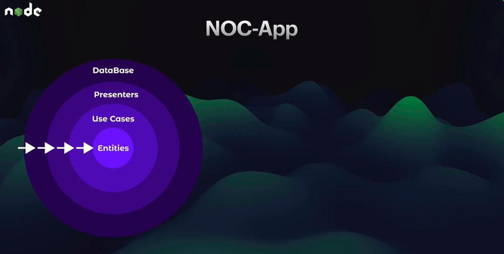
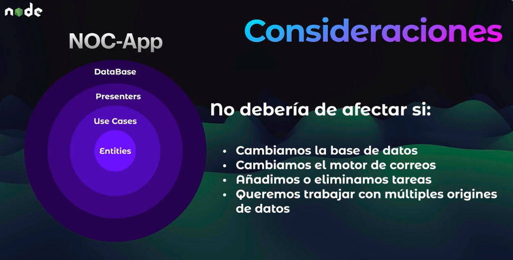
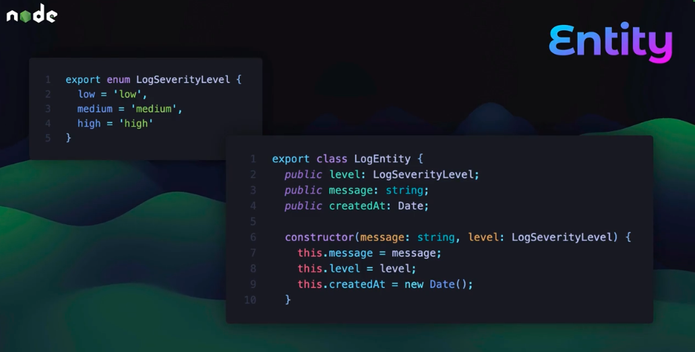
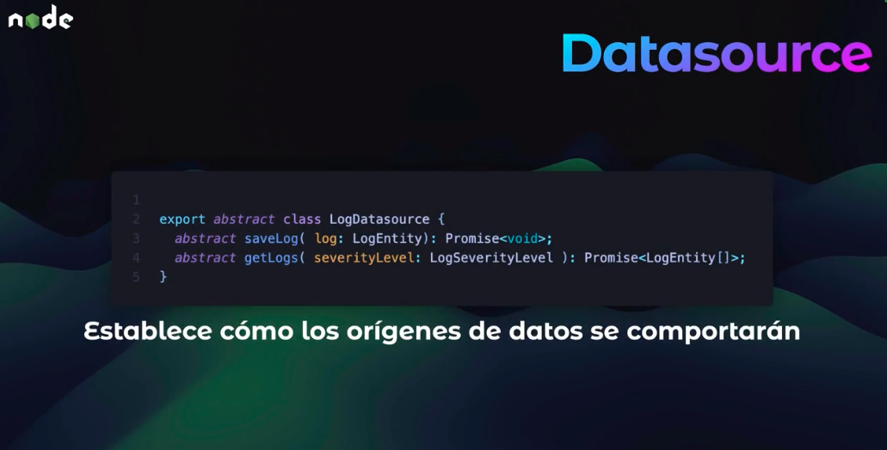
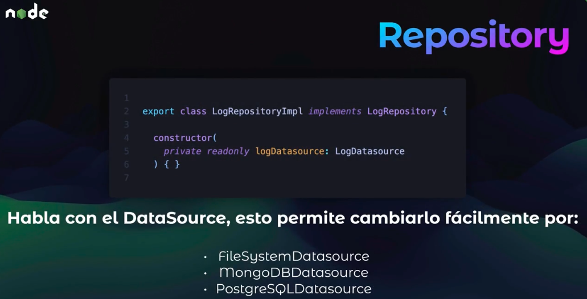
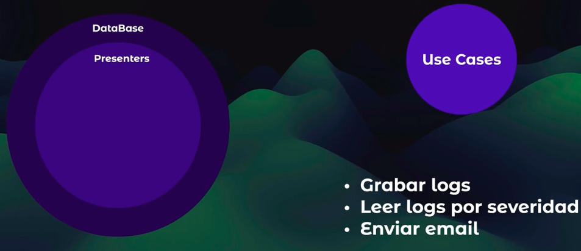
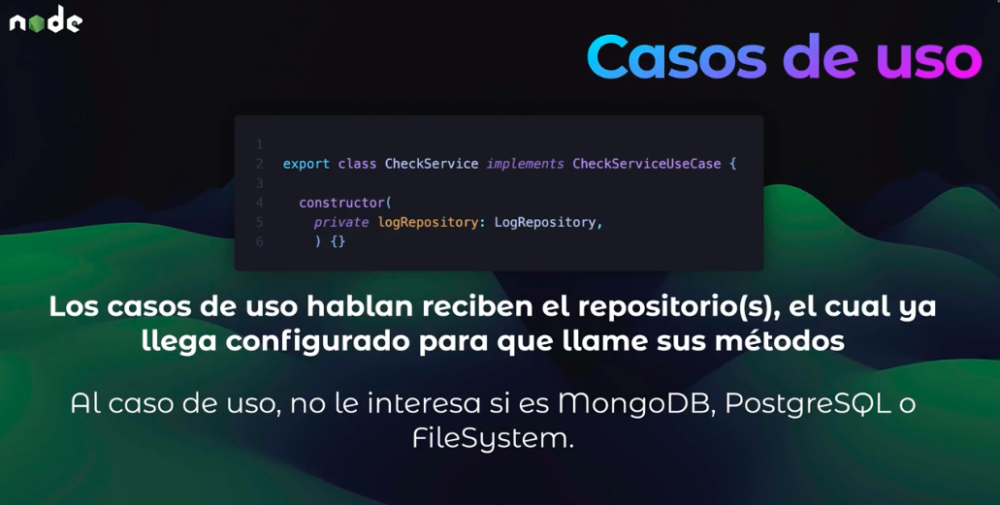
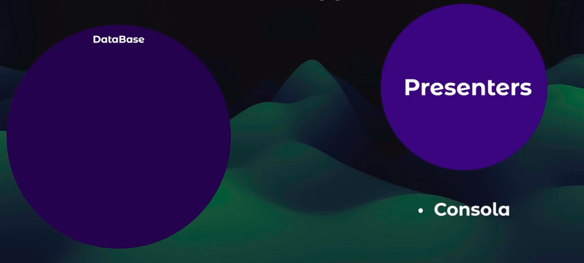
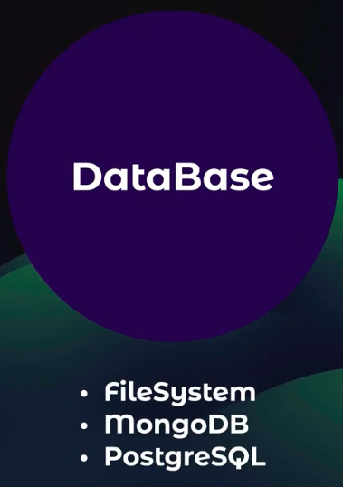

# NOC App (Network Operations Center)

NOTE: After clone:

1. Create and config .env file with:

   ```text
   PORT=3000
   MAILER_SERVICE=
   MAILER_EMAIL=
   MAILER_SECRET_KEY=
   PROD=false

   MONGO_URL=
   MONGO_DB_NAME=
   MONGO_USER=
   MONGO_PASS=
   ```

   _[Get gmail secret key here](https://myaccount.google.com/u/0/apppasswords)_

2. Next, run:

   ```sh
   pnpm i
   docker compose up -d
   pnpm dev
   ```

## Node with TypeScript - TS-Node-dev (better than nodemon when use typescript)

### This app was initialized with this steps

1. Install TypeScript and other dependencies

   ```sh
   pnpm i -D typescript @types/node ts-node-dev rimraf
   ```

2. Initialize TypeScript config file (then, add other config that you like)

   ```sh
   pnpm exec tsc --init --outDir dist/ --rootDir src
   ```

3. Create scripts dev, build and start ([More about TS-Node-dev here](https://www.npmjs.com/package/ts-node-dev))

   ```JSON
   "dev": "tsnd --respawn --clear src/app.ts",
   "build": "rimraf ./dist && tsc",
   "start": "npm run build && node dist/app.js"
   ```

### Jest with TypeScript config

Official documentation [about Jest](https://jestjs.io/docs/getting-started)

1. Development installs (super test is great to test Express)

   ```sh
   pnpm i -D jest @types/jest ts-jest supertest
   ```

2. Crear archivo de configuración de Jest

   ```sh
   pnpm exec jest --init
   ```

3. config **jest.config.js** file

   ```ts
   preset: 'ts-jest',
   testEnvironment: "jest-environment-node",

   // Opcional - The paths to modules that run some code to configure or set up the testing environment before each test
   // setupFiles: ['dotenv/config'],
   ```

4. Add the following scripts to the **package.json** file

   ```sh
   "test": "jest",
   "test:watch": "jest --watch",
   "test:coverage": "jest --coverage",
   ```

## This app use clean architecture. Next, you can see some considerations about this




















## Dependencies

Production:

- [Cron](https://www.npmjs.com/package/cron): cron is a robust tool for running jobs (functions or commands) on schedules defined using the cron syntax. Perfect for tasks like data backups, notifications, and many more!

- [Dotenv](https://www.npmjs.com/package/dotenv): Dotenv is a zero-dependency module that loads environment variables from a .env file into process.env. Storing configuration in the environment separate from code is based on The Twelve-Factor App methodology.

- [Env-Var](https://www.npmjs.com/package/env-var): Verification, sanitization, and type coercion for environment variables in Node.js and web applications. Supports TypeScript!

- [Node Mailer](https://www.npmjs.com/package/nodemailer): Send emails from Node.js – easy as cake! 🍰 📧

- [Mongoose](https://www.npmjs.com/package/mongoose): Mongoose is a MongoDB object modeling tool designed to work in an asynchronous environment. Mongoose supports Node.js and Deno (alpha).

Development:

- [git linter](https://www.npmjs.com/package/git-commit-msg-linter): A lightweight, independent, 0 configurations and joyful git commit message linter. 👀 Watching your every git commit message INSTANTLY 🚀.


- [Typescript](https://www.npmjs.com/package/typescript): TypeScript is a language for application-scale JavaScript. TypeScript adds optional types to JavaScript that support tools for large-scale JavaScript applications for any browser, for any host, on any OS. TypeScript compiles to readable, standards-based JavaScript.

- [@types/node](https://www.npmjs.com/package/@types/node): This package contains type definitions for node [https://nodejs.org/](https://nodejs.org/).

- [@types/nodemailer](https://www.npmjs.com/package/@types/nodemailer): This package contains type definitions for nodemailer

- [ts-node-dev](https://www.npmjs.com/package/ts-node-dev): It restarts target node process when any of required files changes (as standard node-dev) but shares Typescript compilation process between restarts. This significantly increases speed of restarting comparing to node-dev -r ts-node/register ..., nodemon -x ts-node ... variations because there is no need to instantiate ts-node compilation each time.

- [rimraf](https://www.npmjs.com/package/rimraf): The UNIX command rm -rf for node.
